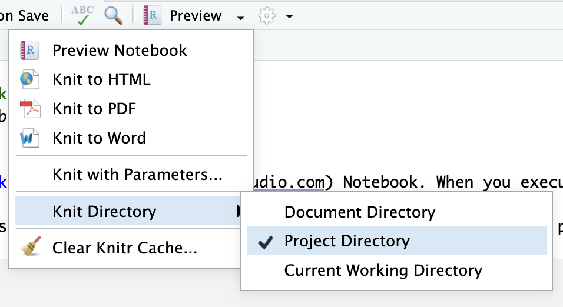

# generalR

This repository holds the datasets used in the [generalR](http://www.riffomonas.org/generalR/) tutorials.

# AGG info

## Instruction files

You're going to follow the 15 "session" tutorials to learn more about R, written by Pat Schloss [site](<https://riffomonas.org/generalR/>).

-   [00 instructions](https://riffomonas.org/generalR/00_session.html)
-   [01 instructions](https://riffomonas.org/generalR/01_session.html)
-   [02 instructions](https://riffomonas.org/generalR/02_session.html)
-   [03 instructions](https://riffomonas.org/generalR/03_session.html)
-   [04 instructions](https://riffomonas.org/generalR/04_session.html)
-   [05 instructions](https://riffomonas.org/generalR/05_session.html)
-   [06 instructions](https://riffomonas.org/generalR/06_session.html)
-   [07 instructions](https://riffomonas.org/generalR/07_session.html)
-   [08 instructions](https://riffomonas.org/generalR/08_session.html)
-   [09 instructions](https://riffomonas.org/generalR/09_session.html)
-   [10 instructions](https://riffomonas.org/generalR/10_session.html)
-   [11 instructions](https://riffomonas.org/generalR/11_session.html)
-   [12 instructions](https://riffomonas.org/generalR/12_session.html)
-   [13 instructions](https://riffomonas.org/generalR/13_session.html)
-   [14 instructions](https://riffomonas.org/generalR/14_session.html)
-   [15 instructions](https://riffomonas.org/generalR/15_session.html)

## Getting started with Session 00

If you don't already have R and RStudio on your device, do the following steps

-  Download [R](https://cloud.r-project.org/)
-  Download [RStudio](https://www.rstudio.com/products/rstudio/download/#download)
		-  This is how you interact with a user interface for R

You should already have GitHub Desktop downloaded from the first GitHub Classroom assignment.

We're now going to clone this repository onto your device so that you can work on the files in RStudio as a project

-  Open GitHub Desktop
-  If you've already cloned another repository, click on the name of that repo in the "current repository" section
-  Click "Add"
-  Click "Clone Repository"
-  Select "GitHub" tab
-  Find this repository
-  Choose the path for the local "Development" folder that you created
-  Click "Clone"

### Open code as an R project

After cloning the files onto your computer

-  Click the button next to "View the files of your repository in Finder/File Explorer"
-  Find the generalR.Rproj file
-  Double-click to open that file. This should open the project in RStudio

## Your tasks

For each of the tutorials, you will use the provided R Notebook for each session within the [1.Notebooks](./1.Notebooks) folder. When you open each notebook, be sure to change the knit directory to the project directory. Do this by clicking the downward arrow by "Preview," then selecting Knit Directory -\> Project Directory

## Commits

After completing each tutorial, be sure to use GitHub Desktop to commit your changes.

Use the following structure for your commit name when you have finished a tutorial

"[initials]/submit [\##]"

Example "AGG/submit 00" if Dr. Gibson was submitting 00.

You can use the pull request "Feedback" to ask Dr. Gibson for help as you go, or for specific areas on which you'd like feedback.
